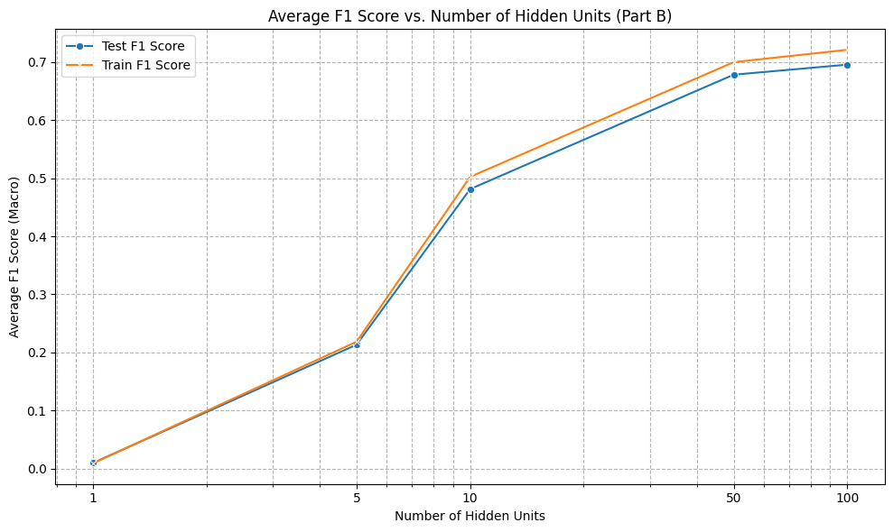
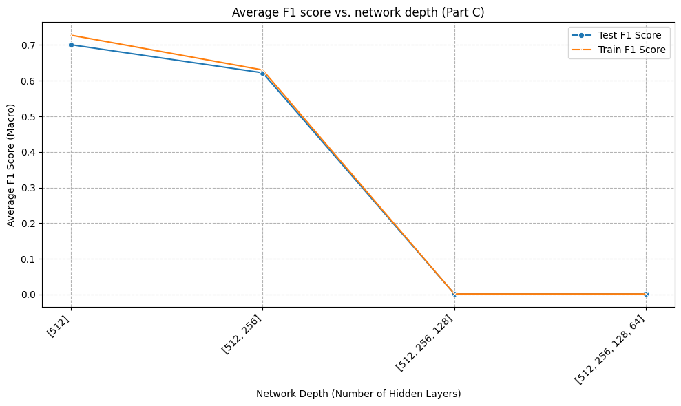
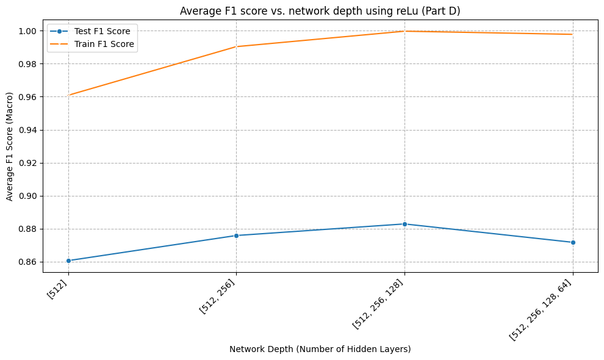
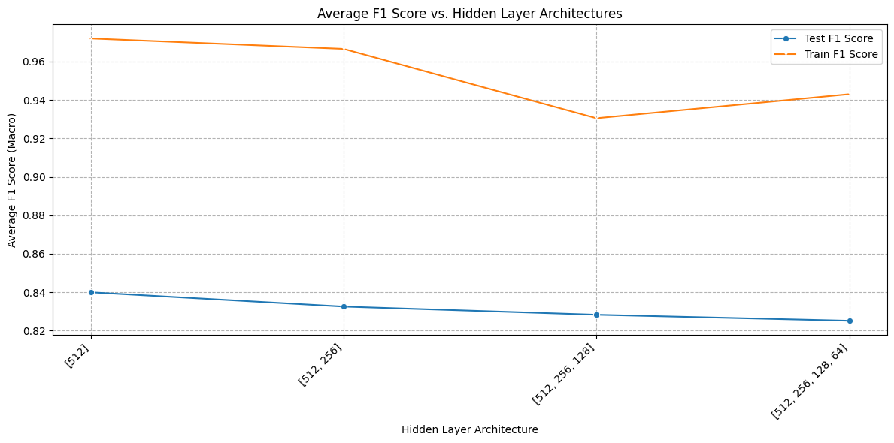
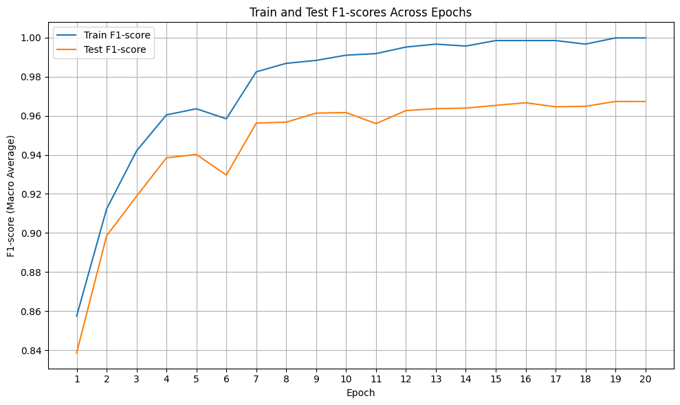
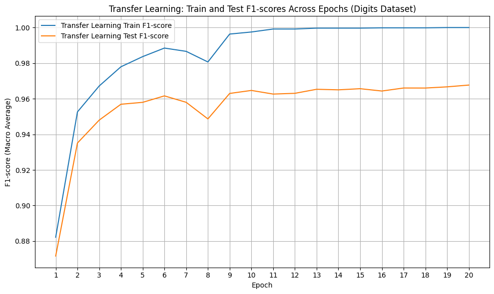
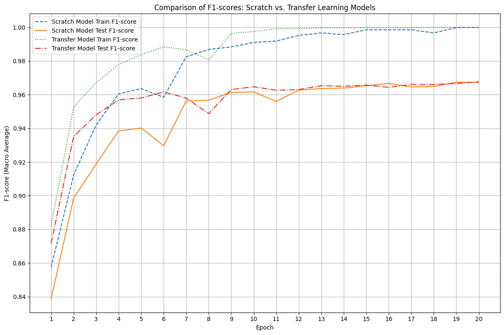

# Deep Learning Foundations

Understanding deep learning by implementing neural networks from scratch and comparing them with modern transfer learning techniques.

## Overview

This repository explores the foundations of deep learning through two complementary projects.

**Project 1** implements a fully connected neural network entirely from scratch using only NumPy — forward propagation, backpropagation, mini-batch gradient descent, and hyperparameter tuning — with no autograd, no framework shortcuts.

**Project 2** compares a CNN trained from scratch against transfer learning with a pretrained feature extractor, quantifying the real-world trade-off between training a model end-to-end and fine-tuning an existing one.

Together, they cover both the math underneath deep learning and how that math plays out in practice.

## Repository Structure

```
.
├── notebooks/
├── src/
├── assets/
├── README.md
└── requirements.txt
```

---

## Project 1 — Neural Network from Scratch

### Features

- Neural network implemented entirely in NumPy (no PyTorch/TensorFlow)
- Configurable hidden layer width and depth
- ReLU and Sigmoid activation functions
- Softmax output layer
- Manually implemented backpropagation
- Mini-batch gradient descent with early stopping
- Systematic hyperparameter analysis
- Benchmarked against Scikit-learn's `MLPClassifier`

### Experiments

**Effect of hidden layer width (Part B)**



F1 score scales sharply with hidden units on this task — from ~0.01 at 1 unit to ~0.70 at 100 units — with most of the gain happening between 5 and 50 units. Beyond 50 units, returns flatten out, showing the network is capacity-limited at the low end but not gaining much from further width alone.

**Effect of network depth — Sigmoid (Part C)**



This is the most interesting result in the repo: stacking more sigmoid layers *without* adjusting the training setup collapses performance from ~0.70 F1 at one hidden layer to **0** at three or more layers — a textbook demonstration of the vanishing gradient problem. Deeper isn't automatically better; it's actively worse without the right activation/initialization choices.

**Effect of network depth — ReLU (Part D)**



Swapping sigmoid for ReLU removes the collapse entirely. F1 improves from ~0.86 to ~0.88 as depth increases from 1 to 3 layers, before mildly tapering at 4 layers — the difference between a network that trains and one that doesn't comes down to a single activation function.

**Comparison against Scikit-learn's MLPClassifier**



Comparing this from-scratch implementation against `sklearn`'s MLP across the same architectures: test F1 starts around 0.97 for a single hidden layer and gradually declines as more layers are added, consistent with the depth findings above — deeper, wider architectures need more careful tuning to actually outperform simpler ones.

### Key Findings — Project 1

- Vanishing gradients are not a theoretical concern — they visibly destroy performance in a plain sigmoid network beyond 2 hidden layers.
- ReLU alone recovers stable training at the same depths where sigmoid collapses.
- More hidden units help up to a point, then plateau — width isn't a free lunch either.

---

## Project 2 — Transfer Learning vs. Training from Scratch

Two approaches to the same image classification task, evaluated on identical data splits:

- **Model A** — CNN trained completely from scratch
- **Model B** — Transfer learning using a pretrained convolutional feature extractor

### Training Curves

 

### Scratch vs. Transfer Learning



Over 20 epochs, the transfer learning model reaches ~95% train F1 by epoch 2 — the from-scratch model takes until epoch 7 to cross that mark. Both models converge to a similar final test F1 (~0.965–0.968), so on this dataset the from-scratch CNN eventually catches up in accuracy — but transfer learning gets there in roughly a third of the epochs, which is the more realistic advantage in practice: less compute, less wall-clock time, same ceiling.

### Key Findings — Project 2

- Transfer learning converges dramatically faster (by ~5x fewer epochs to reach comparable train F1).
- Final test performance between the two approaches ends up close, but the scratch model needs substantially more training time to get there.
- The gap between train and test F1 (~3 points) is consistent across both models, suggesting similar generalization behavior rather than transfer learning simply overfitting less.

---

## Combined Takeaways

- Implementing backpropagation and gradient descent manually surfaces failure modes (like vanishing gradients) that are invisible when using high-level frameworks — you only really understand *why* ReLU replaced sigmoid after watching sigmoid fail.
- Transfer learning's main advantage here isn't a better ceiling — it's speed to get there.
- Architecture choices (depth, width, activation) interact in ways that aren't obvious in isolation; the depth results only make sense once you compare sigmoid against ReLU side by side.

## Technologies Used

- Python
- NumPy
- Matplotlib
- Scikit-learn

## License

MIT License
