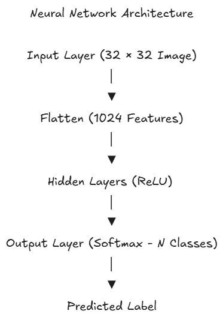
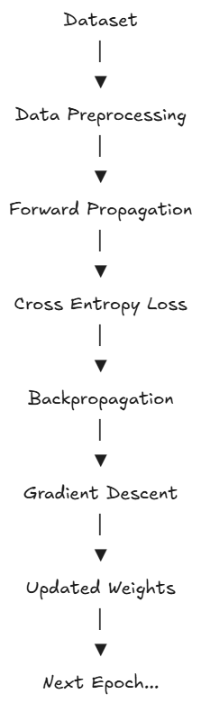

# Deep Learning Foundations

> **Understanding deep learning by implementing neural networks from scratch and comparing them with modern transfer learning techniques.**


## Overview

This repository explores the foundations of deep learning through two complementary projects.

The first project implements a fully connected neural network from scratch using only **NumPy**, covering every stage of the learning process including forward propagation, backpropagation, gradient descent, and hyperparameter tuning.

The second project compares training a convolutional neural network from scratch with transfer learning, highlighting the advantages of pretrained feature extractors in computer vision tasks.

Together, these projects demonstrate both the mathematical foundations of deep learning and their practical applications.

---

## Repository Structure

```text
.
├── notebooks/
├── src/
├── assets/
├── README.md
└── requirements.txt
```

---

# Project 1 — Neural Network from Scratch

### Features

* Neural network implemented entirely in NumPy
* Configurable hidden layers
* ReLU and Sigmoid activation functions
* Softmax output layer
* Backpropagation
* Mini-batch Gradient Descent
* Early stopping
* Hyperparameter analysis
* Comparison with Scikit-learn MLP

---

## Architecture



---

## Training Pipeline



## Experiments

The following experiments were conducted.

* Effect of hidden layer width
* Effect of network depth
* Performance evaluation using Precision, Recall and F1-score
* Comparison against Scikit-learn's implementation

---

## Results

Include

```
Hidden Units vs F1

Network Depth vs F1
```

---

# Project 2 — Transfer Learning vs Training from Scratch

This project compares two different approaches for image classification.

### Model A

CNN trained completely from scratch.

### Model B

Transfer learning using a pretrained convolutional neural network.

Both models are evaluated on the same dataset to compare

* convergence speed
* generalization
* classification performance
* training efficiency

---

## Comparison

Include

```
Training Curves

Scratch vs Transfer Learning

Confusion Matrix
```

---

# Key Findings

* Transfer learning converges significantly faster than training from scratch.
* Increasing hidden units improves performance only up to a certain point.
* Increasing network depth without appropriate optimization may reduce performance.
* Implementing backpropagation manually provides valuable insight into how neural networks learn.

---

# Technologies Used

* Python
* NumPy
* Matplotlib
* Scikit-learn

# Repository Highlights

✔ Neural Network implemented from scratch

✔ Backpropagation implementation

✔ Hyperparameter analysis

✔ Transfer Learning

✔ Computer Vision

✔ Educational visualizations

---

# License

MIT License
